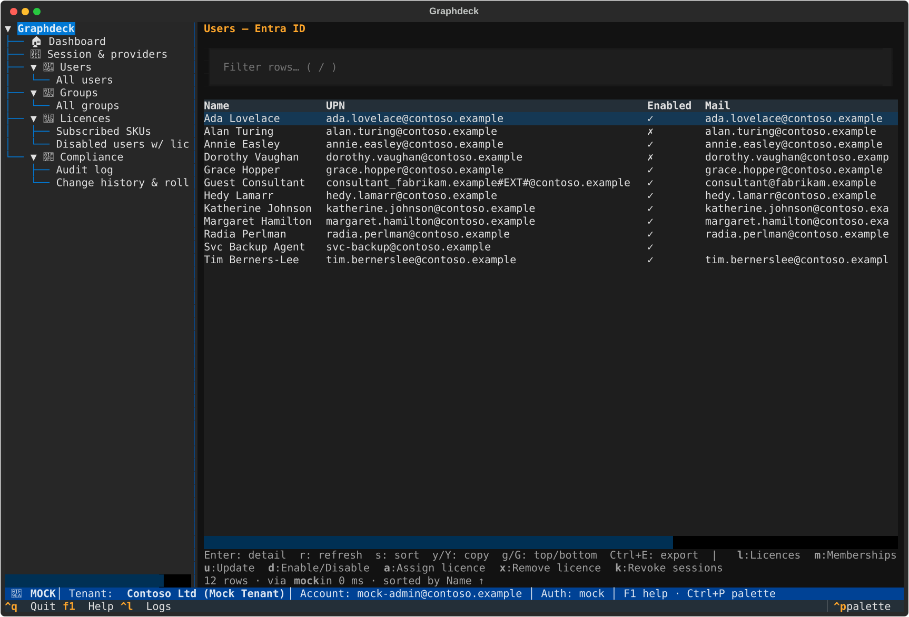
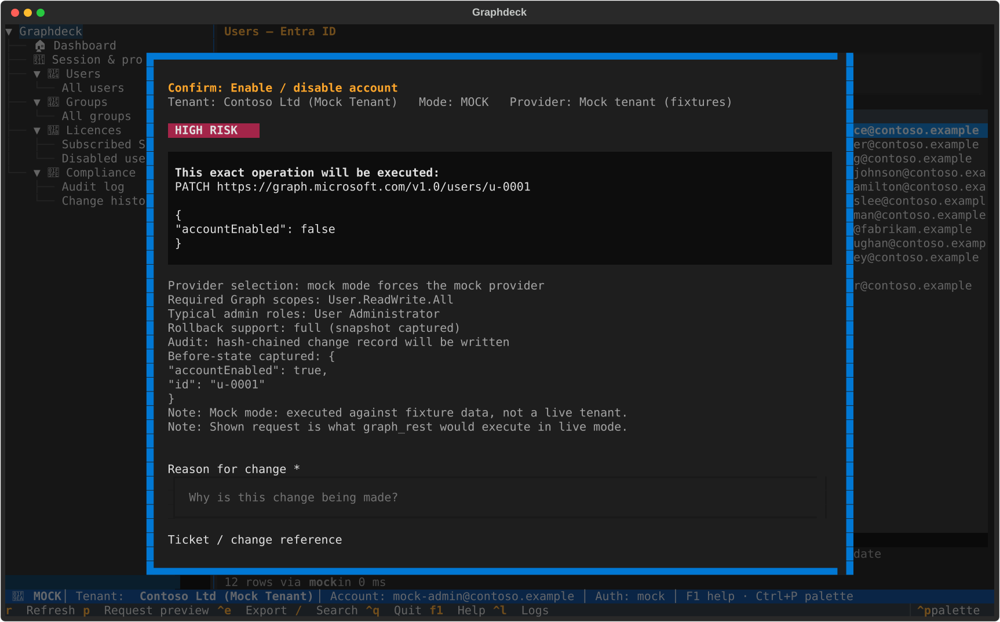

# Graphdeck (msgraph-tui)

**A provider-transparent Microsoft 365 administration console for the
terminal** — safer, faster, more discoverable and more auditable than raw
PowerShell, raw Graph calls or the web admin portals, without ever hiding
what it runs on your tenant.



## Why

Microsoft's web portals hide advanced settings and lag the platform;
PowerShell and Graph expose everything but with no guardrails, no change
record and no undo. Graphdeck sits in the middle:

- **Full power** — executes through the best supported Microsoft interface
  per task: Microsoft Graph REST, Graph SDK, Graph PowerShell, or workload
  modules (Exchange Online, Teams, SharePoint, Security & Compliance).
  PowerShell is a first-class backend, not a fallback — the
  [capability matrix](docs/capability-matrix.md) is honest about where Graph
  has no parity.
- **Total transparency** — every action shows the exact Graph request or
  PowerShell command before it runs, plus required scopes/roles, risk level
  and rollback support.

  

- **Change control built in** — before-state capture, change reasons and
  ticket references, typed confirmation for high-risk actions, hash-chained
  tamper-evident audit log, evidence-pack export for auditors, and
  drift-checked rollback as a controlled compensating change.
- **Keyboard-first** — navigation tree, command palette, rich filterable
  tables, guided forms, exports to JSON/CSV/Markdown/text.

## Quick start (no tenant required)

```bash
pip install .          # Python 3.11+
graphdeck --mock       # full product against a fixture tenant
```

Mock mode exercises everything: browsing, writes, audit, rollback. Add
`--dry-run` to rehearse changes with the full safety pipeline but zero
execution, or configure live mode per the
[user guide](docs/user-guide.md).

```bash
pip install '.[live]'  # adds MSAL for live Graph sign-in (device code)
graphdeck --live
```

## Status

Users, Groups and Licences modules end-to-end (mock + live Graph REST with
device-code or certificate app-only sign-in); Exchange, Teams, SharePoint and
Purview (read-only) modules on a persistent PowerShell host; bulk multi-select
changes; an optional four-eyes approval gate with personal Ed25519 approver keys,
offline signing, git/PR review and webhook notifications; audit/rollback/evidence complete; and a test suite that runs with no
tenant, network, or PowerShell. The workload PowerShell modules are tested
against fixtures and a fake host, not yet a live tenant.

Recent hardening & polish: tamper-evident audit log with a head anchor
(truncation detection), optional HMAC keying and concurrency locking; broadened
secret redaction; endpoint validation; headless CLI (`verify-audit`,
`evidence-pack`, `purge`, `actions`); command-palette action search; column
sorting, copy-as-JSON/CSV, dashboard posture tiles; role-assignable-group
warnings and full change-reason capture in the confirmation gate; ruff + mypy
clean with CI across Linux/macOS/Windows.

Roadmap and provider coverage: [capability matrix](docs/capability-matrix.md),
milestones in the [PRD](docs/PRD.md).

## Documentation

| Doc | Contents |
|---|---|
| [PRD](docs/PRD.md) | product requirements, personas, milestones, Definition of Done |
| [Architecture](docs/architecture.md) | technology decision (why Python + Textual), system design |
| [Capability matrix](docs/capability-matrix.md) | honest per-task provider coverage |
| [User guide](docs/user-guide.md) | install, modes, keyboard model, troubleshooting, limitations |
| [Developer guide](docs/developer-guide.md) | adding actions, providers, modules; testing |
| [Security model](docs/security-model.md) | secrets, redaction, injection resistance, threat model |
| [Compliance & audit](docs/compliance-and-audit.md) | audit chain, evidence packs, ISO 27001 stance |
| [Rollback guide](docs/rollback-guide.md) | snapshot model, sanity checks, worked examples |

> **Compliance note:** Graphdeck provides supporting technical controls and
> evidence for organisations working with ISO/IEC 27001-aligned processes.
> It does **not** by itself make an organisation compliant.

## Development

```bash
pip install -e '.[dev]'
python -m pytest        # no tenant, no network, no PowerShell needed
```

Licensed under the terms in [LICENSE](LICENSE).
